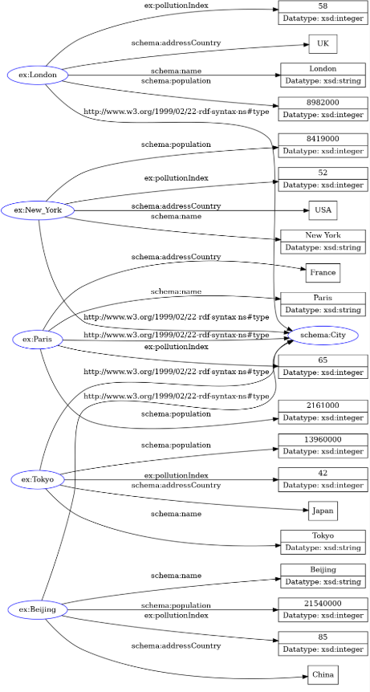

# Semantic Data Interoperability POC: CSV to RDF Converter

This project acts as a Proof of Concept (POC) for Semantic Web technologies. It demonstrates how to transform flat, unstructured data (CSV) into a structured **Knowledge Graph** using W3C standards (RDF/Turtle).



*Visual representation of the generated RDF graph: Implicit CSV rows become explicit relationships.*

## The Concept
Standard CSV files are "dumb" data—they don't contain context about relationships. By converting them to RDF (Resource Description Framework), we create a **Knowledge Graph** where:
* **Interoperability is native:** We use standard vocabularies like `Schema.org`.
* **Data is machine-readable:** Relationships (Subject-Predicate-Object) are explicit.

## Tech Stack
* **Python 3.12+**
* **[rdflib](https://rdflib.readthedocs.io/)** - The standard Python library for working with RDF (creating triples, managing namespaces, serializing output).
* **Turtle Syntax** (for human-readable output)

## How to Run

1.  **Install dependencies:**
    ```bash
    pip install -r requirements.txt
    ```

2.  **Run the converter:**
    ```bash
    python main.py
    ```

3.  **Check the output:**
    The script generates a file `output/knowledge_graph.ttl`.

## How to Test & Visualize

You can verify the semantic structure without installing anything:

1.  Open the `output/knowledge_graph.ttl` file and copy the content.
2.  Go to the **[RDF Grapher Online Tool](https://www.ldf.fi/service/rdf-grapher)**.
3.  Paste the text into the "RDF Data" box.
4.  Select **"Turtle"** as the format and click **"Visualize"**.

##  Example Output

```turtle
ex:Paris a schema:City ;
    ex:pollutionIndex 65 ;
    schema:addressCountry "France" ;
    schema:name "Paris" .

## Project Structure

```bash
semantic-data-interoperability-poc/
├── data/
│   └── pollution_data.csv    # Input data (raw CSV)
├── output/
│   └── knowledge_graph.ttl   # Output data (structured RDF graph)
├── main.py                   # The ETL script (Extract, Transform, Load to RDF)
├── requirements.txt          # Python dependencies
└── README.md                 # Documentation
